<div align="center">

<picture>
  <source media="(prefers-color-scheme: dark)" srcset="docs/assets/wordmark-dark.png">
  <source media="(prefers-color-scheme: light)" srcset="docs/assets/wordmark-light.png">
  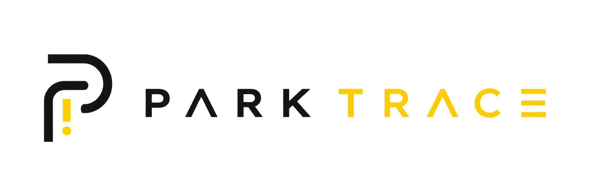
</picture>

### Your phone remembers the walk, not the pin.

**Indoor return navigation for multi-level car parks, with no GPS, no beacons, no venue app and no camera.**

An interactive, offline-capable prototype: park on B3, walk away, and the phone records the route
with no action from you, then guides you back through three floors of mall.

[](https://parktrace.duckdns.org)
[](#known-limitations)

[](https://react.dev)
[](https://www.typescriptlang.org)
[](https://vitejs.dev)
[](https://zustand-demo.pmnd.rs)
[](https://vite-pwa-org.netlify.app)
[](#rendering)
[](#technology-stack)

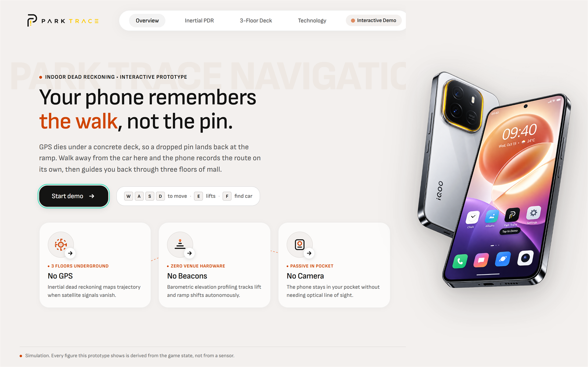

</div>

---

## Table of contents

- [Overview](#overview)
- [Why this is different](#why-this-is-different)
- [The money shot](#the-money-shot)
- [Product walkthrough](#product-walkthrough)
- [The phone app](#the-phone-app)
- [Running the interactive demo](#running-the-interactive-demo)
- [The marketing site](#the-marketing-site)
- [System architecture](#system-architecture)
- [The recording pipeline](#the-recording-pipeline)
- [Algorithms](#algorithms)
- [Verification](#verification)
- [Repository structure](#repository-structure)
- [Technology stack](#technology-stack)
- [Installation](#installation)
- [Running the project](#running-the-project)
- [Building and deploying](#building-and-deploying)
- [Performance](#performance)
- [State management](#state-management)
- [Design system](#design-system)
- [Known limitations](#known-limitations)
- [Roadmap](#roadmap)
- [Documentation](#documentation)

---

## Overview

You park on B3 of a mall. Two hours later you are on L2 with shopping bags, and the only thing your
phone can tell you is where the GPS signal died, which is the ramp, not your car.

Park Trace attacks that from the other end. Instead of trying to fix a position, it records the
**walk**: the trajectory away from the car, sampled continuously while the phone sits in a pocket.
When you ask for your car, the return route is that recorded walk reversed. There is no pathfinding
anywhere in the project, and no map of the venue is needed, because the only route the system will
ever offer is one you have already walked.

This repository is a **playable prototype** of that product. It ships a full isometric mall across
three floors, a simulated Android handset running a Material 3 navigation app, and the complete state
machine: recording, memory creation, route reversal, off-route detection, confidence banding, recovery
and arrival.

> **Everything the phone displays here is simulated.** Distance, steps, turns, floor events and
> confidence are derived from a position the engine already knows exactly. No sensor is read anywhere
> in the build, and every derived figure carries a `SIM` marker in the UI. The real sensor
> architecture (pedestrian dead reckoning, magnetic fingerprinting, DTW alignment, floor-event
> classification, automatic trigger) is specified in
> [the PRD, section 17](docs/LODESTONE_PROTOTYPE_PRD.md), and is deliberately **not** implemented here.

---

## Why this is different

| | Dropped GPS pin | Venue beacon app | **Park Trace** |
|---|---|---|---|
| Works under a concrete deck | no, the fix is lost at the ramp | yes | **yes, motion is the only input** |
| Venue must install hardware | no | yes, BLE beacons plus a survey | **no** |
| Needs a venue-specific app | no | yes | **no** |
| Needs the phone out of your pocket | no | usually | **no** |
| Knows the route, not just the endpoint | no, a point only | partly | **yes, the whole walk, in order** |
| Handles a floor change | no | yes, if surveyed | **yes, recorded as its own event** |
| Says when it does not know | no | rarely | **yes, it drops to Low and stops guessing** |

The last row is the one that matters most. A system that reconstructs position from motion will
accumulate error, so the honest product behaviour is to **detect that it is lost and say so** rather
than to keep issuing confident turn-by-turn instructions. In this prototype that is a real state with
its own screen: step 8 metres off the remembered route for 1.2 seconds and guidance stops, the
confidence chip reads `Low`, and the app falls back to showing you the entire stored route so you can
orient yourself.

---

## The money shot

Two screens, thirty seconds apart in a real run. Left: the moment you leave the car, with nothing
recorded yet and no action taken by the user. Right: back at the car after 261 m across three floors,
having walked out through the lift to L2 and been guided back.

| Leaving the car (B3) | Back at the car (B3) |
|---|---|
| 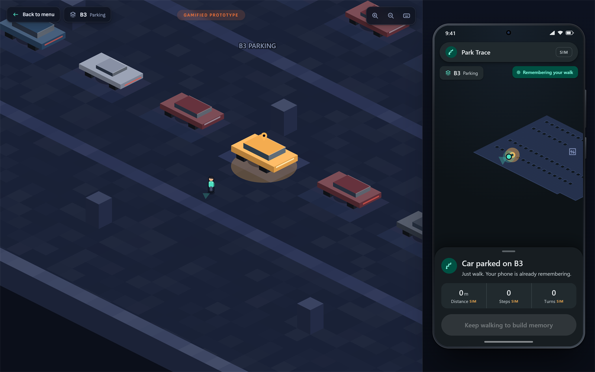 | 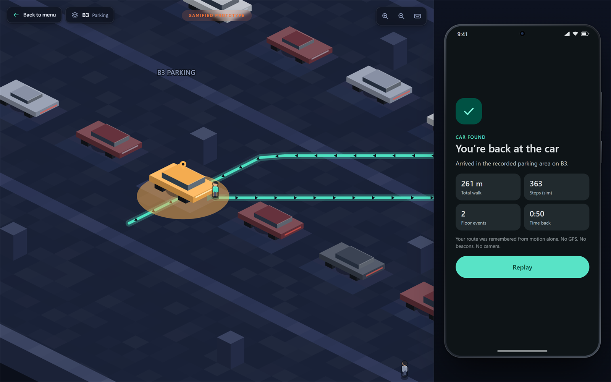 |
| `0 m · 0 steps · 0 turns` | `261 m · 363 steps · 2 floor events · 0:50 back` |

The green ribbon in the right-hand image is not a computed path. It is the player's own recorded
trail, reversed. [`src/sim/trail.ts`](src/sim/trail.ts) contains the whole of it:

```ts
let rev = sim.memory.path.slice().reverse()
```

---

## Product walkthrough

### 1. Parked

The demo opens with the car on B3 and the player beside it. Nothing has been recorded, and no button
has been pressed. The phone shows `Car parked on B3` with the subtitle *"Just walk. Your phone is
already remembering."*


### 2. Remembering

The first step flips the phase from `parked` to `remembering`. There is no start button anywhere in
the app: recording begins on movement, which is the zero-effort principle the product depends on. The
trail samples every **1.5 m or 400 ms**, whichever comes first, and standing still records nothing at
all, which keeps the memory clean with no filtering pass later.

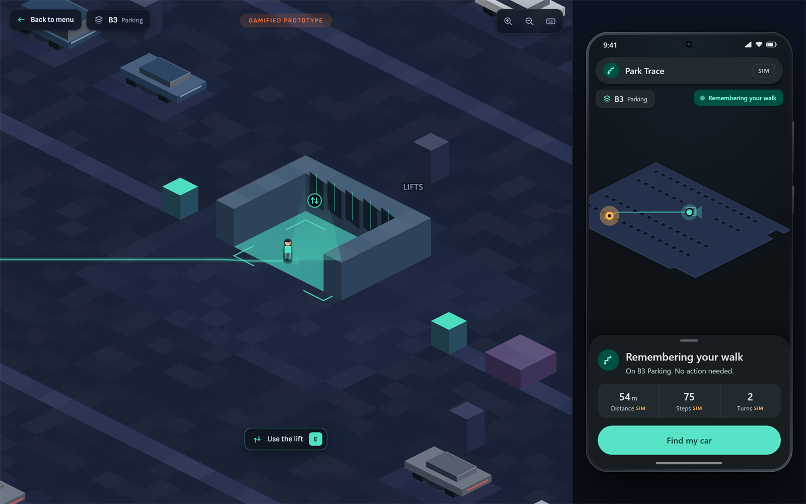

### 3. A vertical transition

Step onto the lift pad and the world offers `Use the lift`. Elevators serve all three floors, so they
present a picker; stairs and escalators are a single hop and skip it.

| The picker | The transition |
|---|---|
| 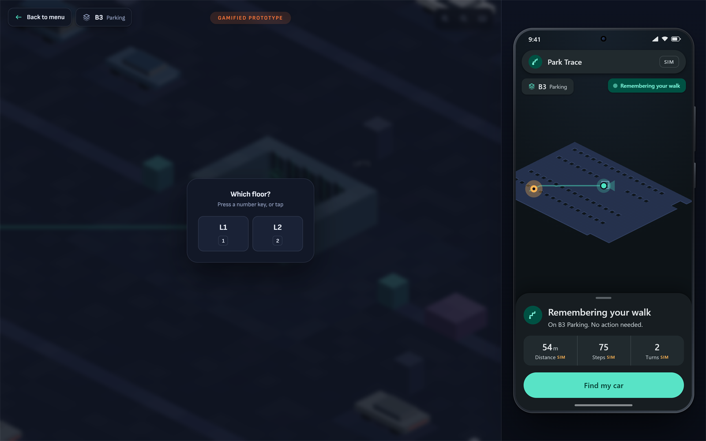 | 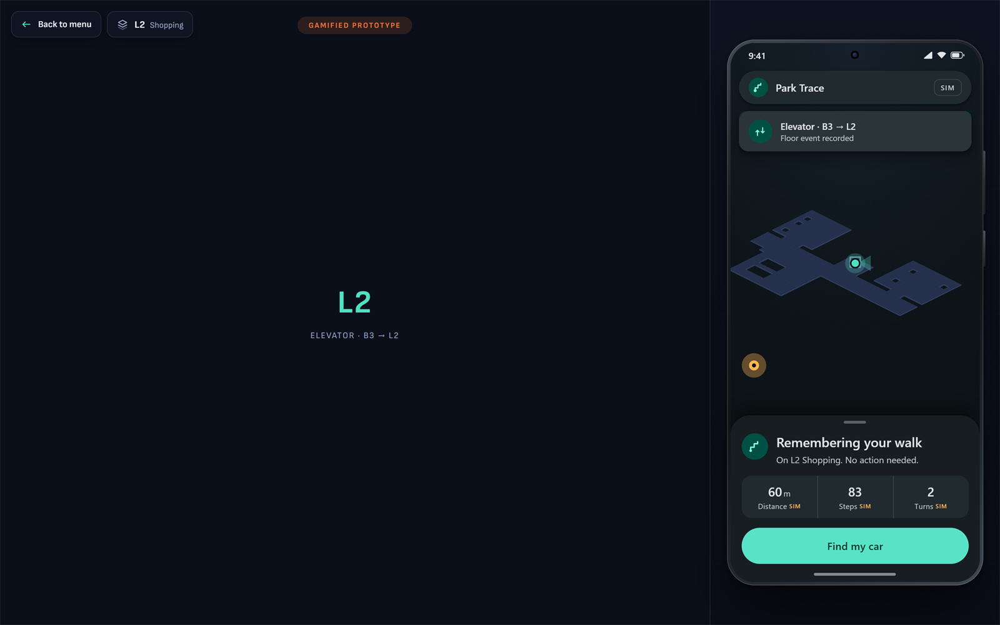 |

A floor change is not a teleport. The trail is anchored with a sample on the departure floor **and**
one on the arrival floor at the same plan coordinates, a `FloorEvent` is appended, and 6 m of distance
is added for the shaft itself. That anchoring is what lets the return route pass through the shaft
with no special-casing, and it is asserted by
[`auditFloorContinuity()`](src/sim/verify.ts).

### 4. Find my car

Once the walk is long enough to be worth remembering (**40 m minimum**, plus at least one floor
event), the phone offers `Find my car`. Tapping it simplifies the recorded trail into guidance points
and prints a summary templated purely from recorded facts.

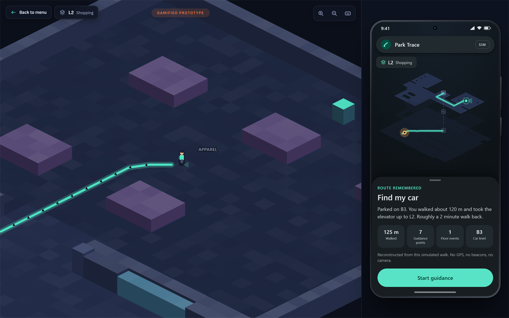

Note the wording: *"in the recorded parking area"*, never a bay number. A real system could not know
one, so this one does not invent one either.

### 5. Guidance

Turn-by-turn against the remembered route, with a live confidence chip. The phone's map is an exploded
three-floor view, so a route that changes level reads as a route that changes level.

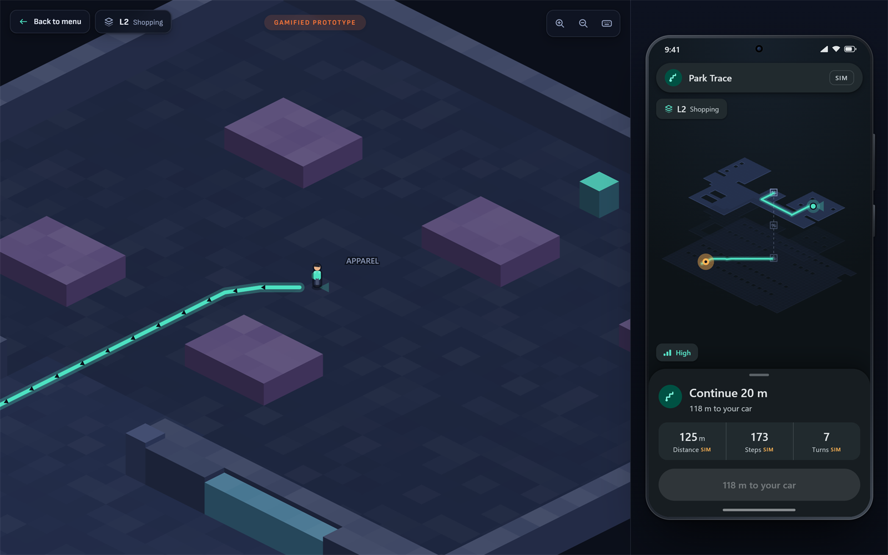

### 6. Off route

Walk 8 m away from the remembered route and hold it for 1.2 seconds. Guidance stops. The chip drops to
`Low`, the instruction becomes *"You've stepped away from the remembered route"*, and the phone shows
the whole stored route rather than guessing a new one.

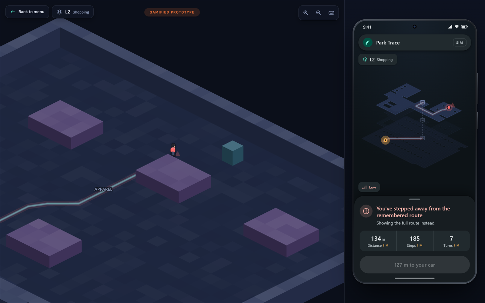

The 8 m out / 4 m in gap is hysteresis. Without it the state flaps every frame when you walk along the
threshold.

### 7. Recovery

Come back within 4 m and hold for 0.6 seconds. Guidance resumes, but from the nearest node **ahead**
of you, so it can never send you backwards along a route you have already covered.

### 8. Car found

Within 3.5 m of the car, on the right floor, held for 400 ms.


---

## The phone app

The simulated handset runs a Material 3 dark navigation app laid out the way a real Android one is:
a full-bleed map with the system bars drawn over it, a floating top bar, and a bottom sheet that owns
all of the guidance content.

| Recording | Route remembered | Guiding | Off route | Arrived |
|:--:|:--:|:--:|:--:|:--:|
| 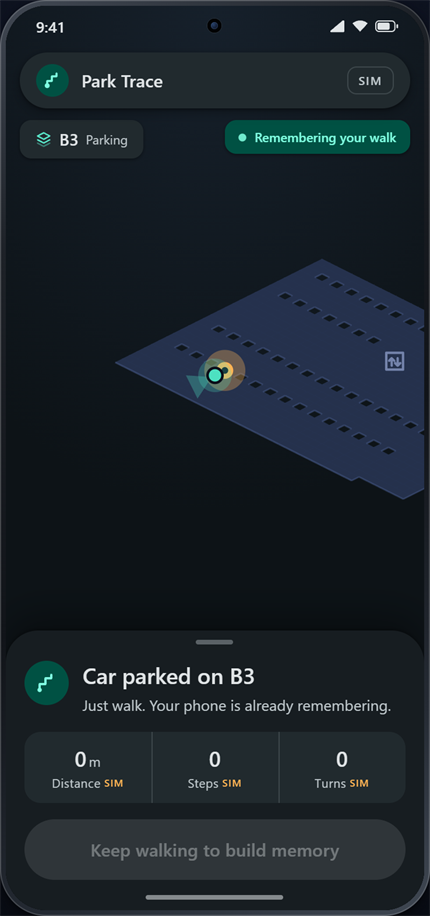 | 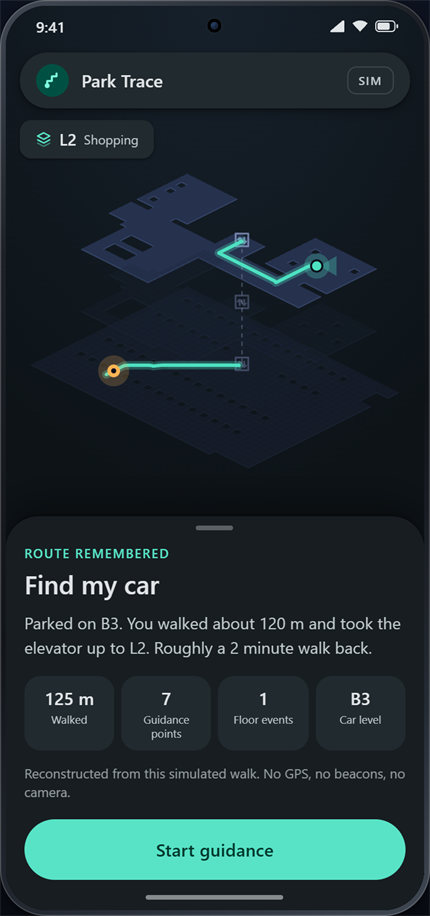 | 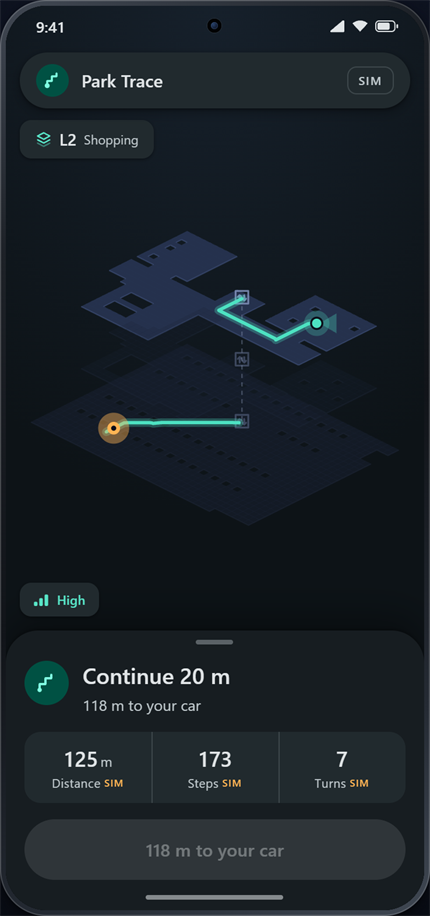 | 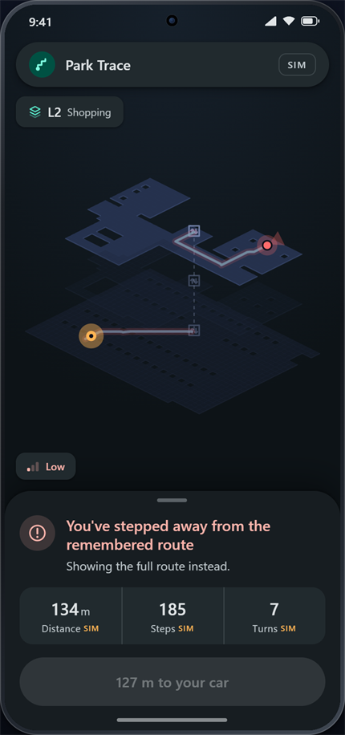 | 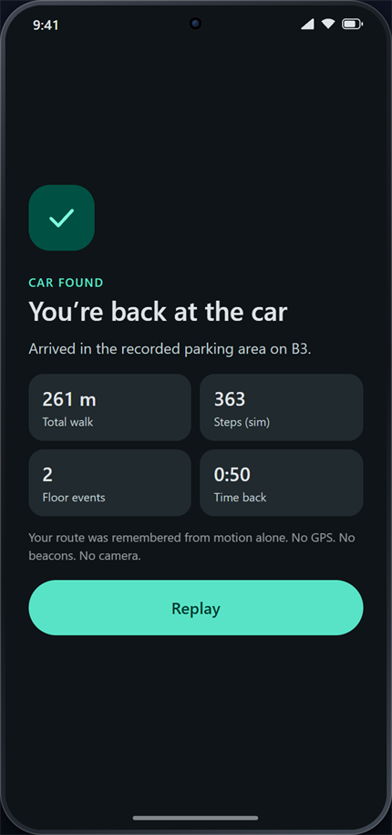 |

Three details worth calling out:

- **The `SIM` markers are load-bearing.** Every derived figure on the stat strip carries one. They are
  a requirement of the spec, not decoration, and removing them to tidy the UI would make the prototype
  dishonest.
- **Confidence never relies on colour alone.** The band is spelled out as a word (`High` / `Medium` /
  `Low`) and carries a three-bar glyph, so it survives colour blindness and a bad projector equally.
- **The phone's "3D" map is not a 3D renderer.** It is three isometric floor plates drawn at an
  offset, with the route stitched between them.

On a narrow viewport the whole layout inverts: the phone becomes the primary surface, the world sits
above it, and an on-screen joystick plus `Find My Car` / `Restart` buttons replace the keyboard.

<div align="center">
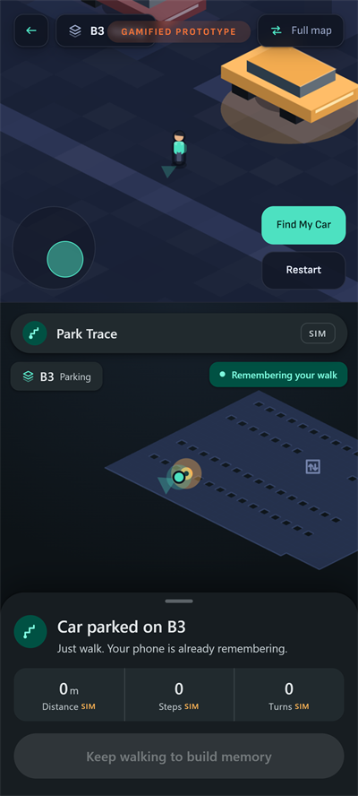
</div>

---

## Running the interactive demo

Press `Start demo` on the landing page, or hit `Enter`.

| Key | Action |
|---|---|
| `W` `A` `S` `D` or arrows | Move (screen-relative: `W` is up-screen, `D` is right-screen) |
| `Shift` | Sprint |
| `E` | Use lift / stairs / escalator, then `1`–`3` to pick a floor |
| `F` | Find my car |
| `G` | Start guidance |
| `R` | Back to menu (full reset) |
| `+` `−` or wheel | Zoom, clamped to 0.6× – 1.6× |
| `Esc` | Toggle the controls overlay |

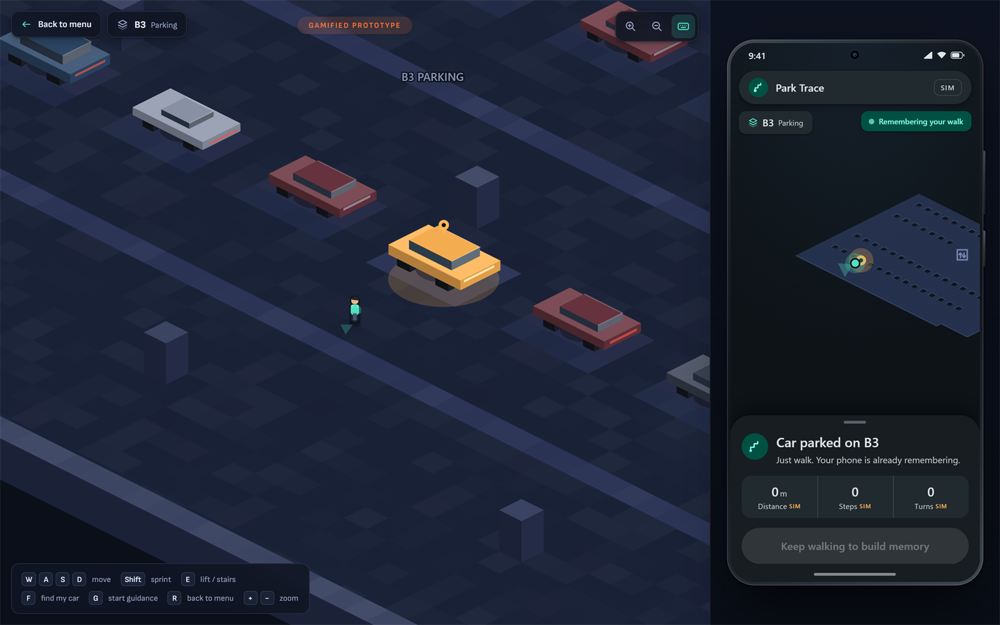

**A complete run**, roughly two minutes:

1. `Start demo`. You are on **B3** beside the car.
2. Hold `D` to cross the deck to the lift lobby.
3. `E`, then `2` to take the lift up to **L2**.
4. Walk the concourse east into the apparel court. Watch `Distance` climb past 40 m; the button
   changes from *Keep walking to build memory* to **Find my car**.
5. `F`. The route overview appears, then guidance auto-starts after 4 seconds (or press `G`).
6. Follow the ribbon back. Deliberately walk away from it for a few seconds to trip the `Low`
   confidence state, then walk back to recover.
7. Take the lift back down to B3 and walk to the car. `Car found`.

`R` returns to the landing screen in under a second, with no page reload.

---

## The marketing site

The landing screen is a four-page product site that explains the real sensor architecture the
prototype stands in for. It runs in front of the live world canvas, not a static backdrop.

| Inertial PDR | 3-Floor Deck | Technology |
|---|---|---|
| 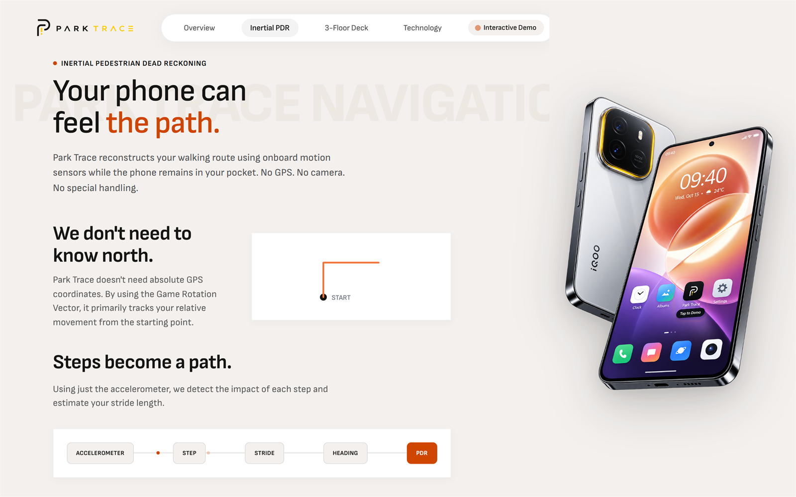 | 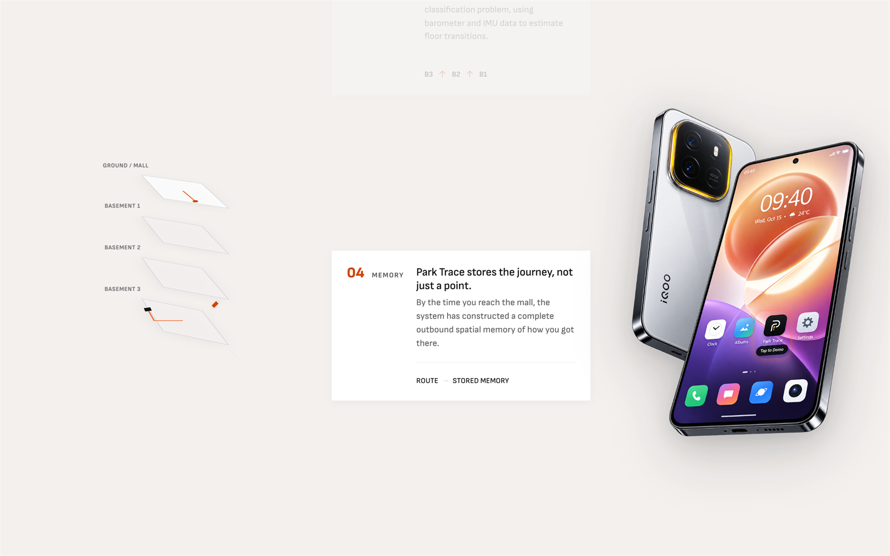 | 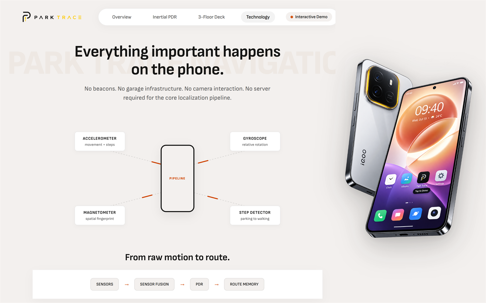 |

A persistent footer on every page reads: *"Simulation. Every figure this prototype shows is derived
from the game state, not from a sensor."*

---

## System architecture

The whole application is built on one rule: **`sim` is the single mutable state object and the only
owner of truth.** The world canvas, the phone map canvas and the React tree are all readers. Nothing
outside `src/sim/` may mutate it.

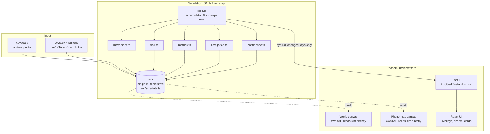
```mermaid
flowchart TB
    subgraph input[" Input "]
        KB["Keyboard<br/>src/ui/input.ts"]
        TOUCH["Joystick + buttons<br/>src/ui/TouchControls.tsx"]
    end

    subgraph core[" Simulation, 60 Hz fixed step "]
        LOOP["loop.ts<br/>accumulator, 8 substeps max"]
        SIM[("sim<br/>single mutable state<br/>src/sim/state.ts")]
        MOVE["movement.ts"]
        TRAIL["trail.ts"]
        METRICS["metrics.ts"]
        NAV["navigation.ts"]
        CONF["confidence.ts"]
    end

    subgraph readers[" Readers, never writers "]
        WORLD["World canvas<br/>own rAF, reads sim directly"]
        PMAP["Phone map canvas<br/>own rAF, reads sim directly"]
        STORE["useUi<br/>throttled Zustand mirror"]
        REACT["React UI<br/>overlays, sheets, cards"]
    end

    KB --> SIM
    TOUCH --> SIM
    LOOP --> MOVE --> SIM
    LOOP --> TRAIL --> SIM
    LOOP --> METRICS --> SIM
    LOOP --> NAV --> SIM
    LOOP --> CONF --> SIM
    SIM -.reads.-> WORLD
    SIM -.reads.-> PMAP
    LOOP -->|syncUI, changed keys only| STORE --> REACT
```

Two consequences fall out of that rule:

- **A stat ticking over never re-renders the world.** `syncUI()` writes only the keys whose value
  actually moved, and every React selector is a primitive compared with `Object.is`.
- **The two surfaces cannot disagree.** The world canvas and the phone map read the same object in the
  same frame, so there is no path by which the map could show one thing and the world another.

### Rendering

Canvas 2D throughout. Nothing here is WebGL, and there is no sprite atlas or art pipeline: every tile,
wall, vehicle, pedestrian and avatar is procedural geometry shaded at draw time.

- **2:1 isometric projection.** Screen-right is `(x - y)` increasing, screen-down is `(x + y)`. The
  transform is orientation-preserving, so a right turn in the world reads as a right turn on screen.
- **Painter's algorithm, no z-buffer.** Props, vehicles and the avatar are sorted back-to-front along
  screen depth `(x + y)`, which is what makes them occlude each other correctly.
- **Viewport culling.** Visible world bounds are derived from the screen corners each frame, with a
  margin for tall props whose tops poke into frame from below.
- **Camera** follows with a lerp of 0.2 and a 16 px dead zone, which is what stops the frame jittering
  when you tap a direction key.

---

## The recording pipeline

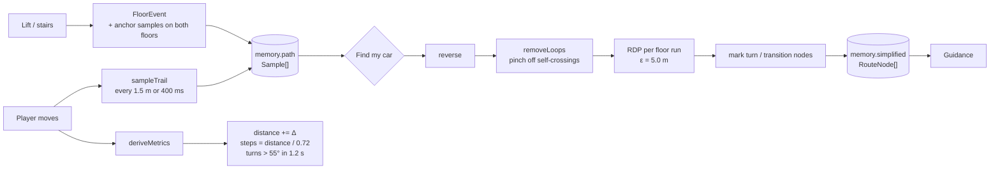
```mermaid
flowchart LR
    A["Player moves"] --> B["sampleTrail<br/>every 1.5 m or 400 ms"]
    B --> C[("memory.path<br/>Sample[]")]
    A --> D["deriveMetrics"]
    D --> E["distance += Δ<br/>steps = distance / 0.72<br/>turns > 55° in 1.2 s"]
    F["Lift / stairs"] --> G["FloorEvent<br/>+ anchor samples on both floors"]
    G --> C
    C --> H{"Find my car"}
    H --> I["reverse"]
    I --> J["removeLoops<br/>pinch off self-crossings"]
    J --> K["RDP per floor run<br/>ε = 5.0 m"]
    K --> L["mark turn / transition nodes"]
    L --> M[("memory.simplified<br/>RouteNode[]")]
    M --> N["Guidance"]
```

Two polylines exist at once, and they do different jobs:

| | `memory.path` | `memory.simplified` |
|---|---|---|
| What it is | every recorded sample | RDP skeleton of the reversed path |
| Typical size | 93 – 196 points in a full run | **7** points |
| Drawn as | the ribbon you follow on screen | not drawn |
| Used for | the visible route, off-route distance | turn-by-turn wording, node advancement |
| Guaranteed walkable | **yes**, you walked it | **no**, see [Known limitations](#known-limitations) |

---

## Algorithms

### Route reversal, and the absence of pathfinding

The return route is `path.slice().reverse()`. There is no A\*, no Dijkstra, no navmesh and no
navigation graph anywhere in `src/`. This is a product decision, not a shortcut: a system with no map
of the venue **cannot** compute a path, and the only route it can honestly offer is one the user has
already walked.

### Ramer-Douglas-Peucker simplification

Applied per floor run rather than to the whole path, so a floor change always survives as its own
node instead of being smoothed away. `RDP_EPSILON = 5.0` m, raised from an earlier 1.2 m to straighten
out the wiggle that a keyboard-driven walk produces.

### Loop removal

Before simplification, `removeLoops()` scans forward for the furthest later sample within 3 m on the
same floor and pinches off everything between. A shopper who doubles back through the same atrium
should not be guided back through it twice.

### Off-route detection with hysteresis

```
off:      distance to route > 8 m,  held for 1200 ms  ->  confidence 0, phase = offRoute
recovery: distance to route < 4 m,  held for  600 ms  ->  confidence 1, resume from the node ahead
```

Distance is measured only against segments on the floor you are actually standing on. Being on a floor
the route never visits is off-route by definition, and skips the hold entirely.

### Confidence

An EMA (α = 0.15) over `1 - distance / 8`, banded at `High ≥ 0.70`, `Medium ≥ 0.35`, `Low < 0.35`.
This is a **distance-to-route heuristic**, not a localization confidence. In the real product it is
two separate scores, PDR quality and DTW alignment cost, which is documented at the top of
[`src/sim/confidence.ts`](src/sim/confidence.ts).

### Derived metrics

All three are derived from a position the engine already knows exactly, and none is measured.

| Metric | Derivation | Stands in for |
|---|---|---|
| Distance | integrated per-frame displacement | PDR path integration |
| Steps | `distance / 0.72 m` | accelerometer peak detection |
| Turns | heading EMA (α = 0.25) accumulating past 55° inside a 1.2 s window, 1 s cooldown | gyro-derived turn events |
| Magnetic series | a sine field synthesised from `(x, y)` | magnetometer magnitude trace |

### World generation

Floors are **carved, not painted**: start from `VOID`, carve walkable regions, then decorate, then
`encase()` wraps everything in walls by promoting any void tile that touches a walkable one. That
ordering guarantees connectivity is something chosen rather than hoped for. The lift sits on identical
grid coordinates (`x: 57, y: 28`) on all three floors, which is what makes a route continuous through
the shaft with no special case.

---

## Verification

The repository ships two test seams that nothing in the running app calls:
[`stepFrames()`](src/sim/loop.ts) advances the simulation deterministically without waiting on
`requestAnimationFrame`, and [`auditPolyline()`](src/sim/verify.ts) walks a polyline at 0.2 m intervals
and reports every sample that lands on a non-walkable tile.

**Map connectivity**, by flood fill from a single walkable tile on each floor:

| Floor | Walkable tiles | Reachable | Orphaned | Transition pads |
|---|---|---|---|---|
| B3 Parking | 8,499 | 8,499 | **0** | 1 (lift) |
| L1 Mall | 4,041 | 4,041 | **0** | 3 (lift, stairs, escalator) |
| L2 Shopping | 3,937 | 3,937 | **0** | 3 (lift, stairs, escalator) |

B3 carries 66 parked cars in 5 rows, all drawn as `4 × 2` tile blocks so the bay gaps are equal, with
the player's own bay left empty.

**Route audit**, from a real 124 m recorded run out to the L2 apparel court:

| Polyline | Points | Segments | Samples tested | Faults | Worst segment |
|---|---|---|---|---|---|
| Drawn ribbon (`memory.path` reversed) | 93 | 91 | 732 | **0** | 1.42 m |
| Guidance skeleton (`memory.simplified`) | 7 | 5 | 538 | **1** | 42.33 m |

Floor continuity on the same run: 1 transition, **0** gaps.

The single skeleton fault is real and reproducible, and is described honestly in
[Known limitations](#known-limitations) below.

---

## Repository structure

```
.
├── src/
│   ├── sim/                  the simulation: 1,449 lines, no rendering, no React
│   │   ├── state.ts          the single mutable sim object and every type
│   │   ├── loop.ts           60 Hz fixed-step accumulator + stepFrames() test seam
│   │   ├── constants.ts      every tuning value in the project
│   │   ├── movement.ts       screen-relative input, wall sliding, frame-rate-independent accel
│   │   ├── trail.ts          sampling, decimation, loop removal, RDP, route building
│   │   ├── metrics.ts        derived distance, steps and turn events
│   │   ├── navigation.ts     node advancement, remaining distance, instruction wording
│   │   ├── confidence.ts     off-route hysteresis, recovery, confidence bands
│   │   ├── floors.ts         pad detection, transitions, trail anchoring
│   │   ├── summary.ts        the natural-language memory summary
│   │   ├── serialize.ts      export / restore a recorded run
│   │   ├── store.ts          the throttled Zustand mirror React reads
│   │   ├── actions.ts        start, restart, find my car, begin guidance
│   │   └── verify.ts         route integrity audits (test seam)
│   │
│   ├── world/                the isometric mall: 1,822 lines
│   │   ├── maps/             per-floor tile grids, carved then encased
│   │   │   ├── build.ts      authoring helpers, shared lift geometry
│   │   │   ├── b3.ts         parking deck, 66 bays, the car, the wrong-turn trap
│   │   │   ├── l1.ts         concourse, food court, atrium, entrance hall
│   │   │   └── l2.ts         cinema, apparel court, balcony ring, skybridge
│   │   ├── renderer.ts       culled painter's-algorithm canvas renderer
│   │   ├── tiles.ts          the 18-tile vocabulary, heights and colours
│   │   ├── iso.ts            the 2:1 projection
│   │   ├── camera.ts         dead-zone follow and zoom clamping
│   │   ├── vehicles.ts       5 procedural car models, deterministic per bay
│   │   ├── avatar.ts         the walking figure, stride driven by distance walked
│   │   ├── npcs.ts           8 ambient pedestrians, a pure function of the clock
│   │   └── MallView.tsx      the canvas host and its own rAF
│   │
│   ├── phone/                the simulated handset: 1,005 lines
│   │   ├── PhoneFrame.tsx    iQOO 15 chassis, or a bare frame on mobile
│   │   ├── PhoneScreen.tsx   the state router
│   │   ├── MemoryMap.tsx     the exploded three-floor map canvas
│   │   ├── Instruction.tsx   per-phase primary and secondary copy
│   │   ├── StatStrip.tsx     distance / steps / turns, each marked sim
│   │   ├── ConfidenceChip.tsx
│   │   ├── StatusBar.tsx
│   │   ├── OriginHomeScreen.tsx
│   │   └── states/           cards, sheets and overlays
│   │
│   ├── ui/                   landing, input, overlays, touch: 1,506 lines
│   │   ├── Landing.tsx       the marketing shell
│   │   ├── pages/            Overview, Inertial PDR, 3-Floor Deck, Technology
│   │   ├── input.ts          keyboard bindings
│   │   ├── TouchControls.tsx joystick and action buttons
│   │   └── WorldOverlays.tsx HUD chips, pickers, veils, legend
│   │
│   ├── styles/               design tokens and component CSS: 4,340 lines
│   └── assets/               wordmarks, device mockup, app icons
│
├── docs/
│   ├── LODESTONE_PROTOTYPE_PRD.md   the 17-section spec this was built from
│   ├── DEPLOYMENT.md                GCP infrastructure and redeploy procedure
│   ├── screenshots/                 the images in this README
│   └── assets/                      README wordmarks
│
├── scripts/
│   ├── deploy.sh             atomic web-root swap, nginx reload, 200 check
│   ├── make-icons.mjs        PWA icon generation
│   ├── make-favicons.mjs     favicons composited onto ink tiles
│   └── make-light-logo.mjs   light-background wordmark variant
│
├── public/icons/             generated PWA icons and favicons
├── index.html
└── vite.config.ts            React plugin + vite-plugin-pwa (generateSW)
```

56 source files, 10,246 lines of TypeScript, TSX and CSS.

---

## Technology stack

| Layer | Technology |
|---|---|
| **Framework** | React 18.3 · TypeScript 5.6 (strict, `tsc --noEmit` gates the build) |
| **Build** | Vite 5.4 · `@vitejs/plugin-react` |
| **State** | A plain mutable object at 60 Hz, mirrored into Zustand 4.5 for React |
| **Rendering** | Canvas 2D, procedural isometric geometry, no WebGL and no sprite atlas |
| **Offline** | `vite-plugin-pwa` 0.20 in `generateSW` mode (Workbox), `autoUpdate` |
| **Styling** | Hand-written CSS with a design-token layer, no framework |
| **Type face** | Sofia Sans, via Google Fonts with `preconnect` |
| **Hosting** | nginx on a GCP `e2-micro`, Let's Encrypt TLS, static files only |

**Three runtime dependencies** (`react`, `react-dom`, `zustand`) and six dev dependencies. No physics
engine, no game framework, no charting library, no icon package: every icon in the app is an inline
SVG.

---

## Installation

**Requirements:** Node.js 18 or newer and npm. Nothing else. There is no backend, no database, no API
key and no `.env` file.

```bash
git clone https://github.com/mridulbansal4/LodeStone.git
```

```bash
cd LodeStone
```

```bash
npm install
```

---

## Running the project

### Development

```bash
npm run dev
```

Then open <http://localhost:5173>. Vite serves native ESM with HMR.

### Production build

```bash
npm run build
```

This runs `tsc --noEmit` first, so a type error fails the build before Vite is invoked. The output
lands in `dist/` as a static, offline-capable PWA that can be dropped on any static host.

### Preview the production build

```bash
npm run preview
```

### Regenerating icons and wordmarks

The icon and logo scripts are dependency-free: they implement PNG decode and encode from scratch on
`node:zlib`, so they need no image library.

```bash
node scripts/make-icons.mjs
```

```bash
node scripts/make-favicons.mjs
```

---

## Building and deploying

The live site runs at **[parktrace.duckdns.org](https://parktrace.duckdns.org)** on a GCP `e2-micro`
in `asia-south1-a`, behind nginx with a Let's Encrypt certificate. Full infrastructure notes are in
[docs/DEPLOYMENT.md](docs/DEPLOYMENT.md).

```bash
npm run build && bash scripts/deploy.sh
```

The script packs `dist/`, uploads it, **swaps the web root atomically** rather than writing over it in
place, reloads nginx and verifies the site returns 200 before reporting success.

Cache policy is deliberate and matters for a PWA: `/assets/*` is immutable and cached for a year
because Vite content-hashes those filenames, while `sw.js`, `registerSW.js` and `index.html` are
`no-store`. If those three were cached, a browser that had already installed the PWA could never see a
new deploy.

---

## Performance

Measured in headless Chrome 152 at 1440 × 900, while walking, with the world canvas, the phone map
canvas and the 60 Hz simulation all live:

| Metric | Value |
|---|---|
| Mean frame | **6.06 ms** |
| p95 frame | 6.20 ms |
| Worst frame in 380 | 6.40 ms |
| JS heap in use | 11.7 MB |
| First contentful paint (dev server) | 408 ms |

Against a 16.7 ms budget for 60 fps that is roughly a third of the frame, on a renderer that culls to
the viewport and draws everything procedurally.

Production bundle:

| Asset | Raw | Gzipped |
|---|---|---|
| `index.js` | 250.45 kB | **75.98 kB** |
| `index.css` | 68.88 kB | **13.78 kB** |
| Device mockup PNG | 1,818.48 kB | (already compressed) |
| Wordmark PNG | 103.77 kB | (already compressed) |
| **Service worker precache** | 21 entries, 2,449.82 KiB | |

The device mockup is 74% of the precache on its own, and is the first thing to fix if the offline
install size matters. See [Known limitations](#known-limitations).

---

## State management

The interesting decision in this codebase is that **React is not the state owner.**

A 60 Hz simulation pushed through React would re-render the tree sixty times a second to move a number
in a stat strip. Instead:

1. `sim` is a plain mutable object, ticked by a fixed-step accumulator in
   [`loop.ts`](src/sim/loop.ts). The frame delta is clamped at 50 ms so a tab switch cannot produce a
   spiral of death, and a guard caps the loop at 8 substeps.
2. The two canvases run their **own** `requestAnimationFrame` loops and read `sim` directly. They never
   subscribe to React state.
3. `syncUI()` runs once per tick and writes into a Zustand store, but only the keys whose value
   actually changed.
4. Components select **primitives**, one per subscription, so an unchanged value costs no render.

```ts
// src/sim/store.ts
const put = <K extends keyof UiSnap>(k: K, v: UiSnap[K]) => {
  if (s[k] !== v) (patch as Record<string, unknown>)[k as string] = v
}
// ...
if (Object.keys(patch).length) useUi.setState(patch)
```

Ten phases drive the whole application: `landing`, `parked`, `remembering`, `floorTransition`,
`findMyCar`, `routeOverview`, `returnNav`, `offRoute`, `recovered`, `carFound`. The root element
carries the current one as a class (`phase-returnNav`), which is also how the browser tests assert
against it.

---

## Design system

Two visual languages, deliberately kept apart:

- **The marketing site** is a light editorial layout on a cream canvas (`#F3F0EE`) with an ink
  (`#141413`) and burnt-orange (`#F37338`) palette, ghost watermark typography and scroll-revealed
  sections driven by `IntersectionObserver`.
- **The app and the world** are Material 3 dark, keyed to `#0B0F1A`, with a teal accent that also
  serves as the route colour.

Craft rules applied throughout the interactive controls:

- Press feedback is `scale(0.97)` over 100 ms; hover transitions are 150 ms.
- Hit targets carry invisible padding, so a 16 px icon still has a comfortable tap area.
- `prefers-reduced-motion` is honoured: the camera lerp becomes an instant snap and the floor
  transition drops from 1500 ms to 350 ms.
- Every icon is an inline SVG sized in the component, not an icon-font glyph.
- The mobile breakpoint is driven by a `ResizeObserver` on the document element, because `matchMedia`
  `change`, `resize` and `orientationchange` are all unreliable across mobile browsers and emulated
  viewports.

---

## Known limitations

These are real, reproduced, and stated here rather than left to be discovered.

**1. The guidance skeleton can cut through geometry.**
`memory.simplified` is produced by RDP without validating the resulting chords against the walkability
grid. On the audited run, one of its 5 segments spans 42.33 m across the B3 deck from `(58.74, 30.89)`
to `(28.76, 60.77)` and first leaves walkable ground at `(35.97, 53.58)`. The **ribbon the user
actually follows** is the raw recorded path and audits clean at 0 faults, so this affects the
turn-by-turn wording rather than the drawn route, but it is a defect. The fix is to test each
simplified segment with `auditPolyline` and reinsert a waypoint where it fails.

**2. Everything is simulated.**
No sensor is read anywhere in the build. Distance, steps, turns, floor events and confidence are all
derived from a known position. This is by design and is marked in the UI, but it means the prototype
demonstrates the **product**, not the localization.

**3. Confidence is one heuristic standing in for two scores.**
Distance-to-route only. The real model needs PDR quality and DTW alignment cost as separate inputs.

**4. The device mockup is 1.78 MB.**
`src/assets/iqoo15_duo_mockup.png` is 74% of the service-worker precache. Re-encoding it or serving a
WebP with a PNG fallback would cut the offline install size by roughly two thirds.

**5. `SLOW_SPEED` is dead.**
`sim.input.slow` is never set by any input path, so the constant has no effect.

**6. `test.js` at the repository root is debris.**
A UTF-16 fragment of an old component, tracked by accident. It is not a test and nothing imports it.

---

## Roadmap

**Correctness**

- Validate every simplified segment against the walkability grid, reinserting waypoints where a chord
  leaves walkable ground.
- Split confidence into PDR quality and alignment cost, and surface both.

**Toward the real sensor stack** (all specified in [PRD §17](docs/LODESTONE_PROTOTYPE_PRD.md))

- Step detection from accelerometer peaks, with cadence-based stride estimation.
- Relative heading from `TYPE_GAME_ROTATION_VECTOR`, which deliberately omits the magnetic reference
  so garage distortion cannot corrupt it, plus Manhattan grid snapping to bound drift.
- The magnetometer used as a **1D location fingerprint** along the walked path rather than as a
  compass, aligned on return with Dynamic Time Warping. This is the core insight of the product: in a
  car park the magnetic field is not noise to be rejected, it is a signature to be matched.
- Floor changes as a motion-event classification problem over the barometer and IMU.
- An automatic trigger from Bluetooth disconnection plus an activity transition, so recording starts
  with no user action at all.

**Engineering**

- Re-encode the device mockup and drop the precache below 1 MB.
- Promote the `stepFrames()` and `auditPolyline()` seams into a real headless test suite in CI.

---

## Documentation

| Document | What is in it |
|---|---|
| [docs/LODESTONE_PROTOTYPE_PRD.md](docs/LODESTONE_PROTOTYPE_PRD.md) | The 17-section spec this was built from. §7.13 is the constants table, §12.1 records every deviation from plan, §17 is the real sensor architecture. |
| [docs/DEPLOYMENT.md](docs/DEPLOYMENT.md) | GCP infrastructure, DNS, uptime configuration, cache policy and the redeploy procedure. |
| [docs/iqoo_idea.md](docs/iqoo_idea.md) | The original product concept. |

---

<div align="center">

**[Try the live demo](https://parktrace.duckdns.org)**

Built as a hackathon prototype. Every figure the phone shows is simulated, and says so.

</div>
